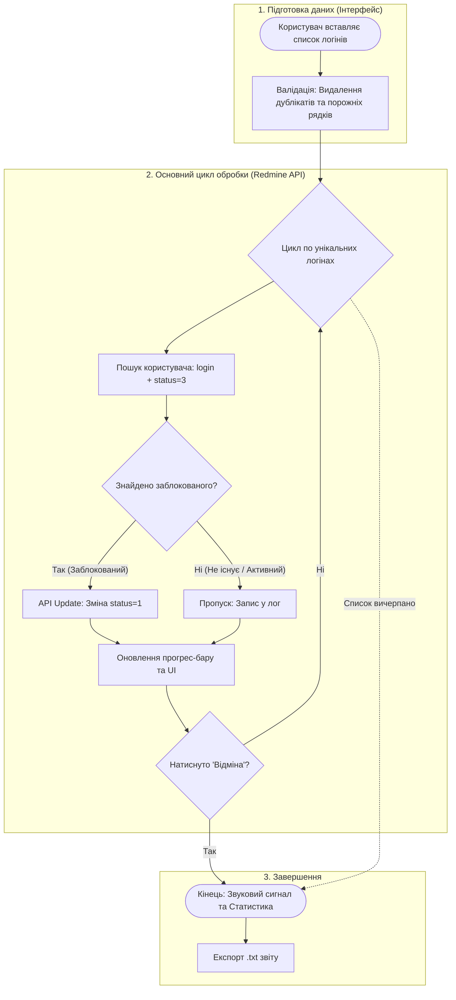

# 🛠 Redmine User Unlocker

GUI-утиліта для швидкого масового розблокування користувачів у системі Redmine за списком логінів.

## 📂 Структура проєкту

У цьому репозиторії зберігаються дві версії скрипта:

* **`main.py` (Стара версія):** Базовий функціонал. Завантажує API-ключ безпечно через `.env`. Працює як простий інструмент без зайвого навантаження.
* **`unlocker.py` (Нова версія):** Покращений функціонал. Додано візуальний прогрес-бар, перевірку на дублікати, локальне логування всіх дій у файл `unlock_history.log` та можливість експортувати звіт у `.txt`.

## 📊 Архітектурна схема роботи (Логіка утиліти)

## ⚙️ Встановлення

1. Склонуйте репозиторій.
2. Встановіть залежності: `pip install -r requirements.txt`
3. Запустіть потрібну вам версію скрипта.